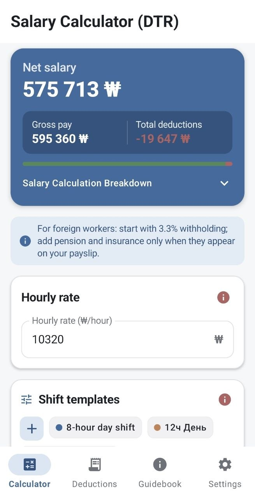
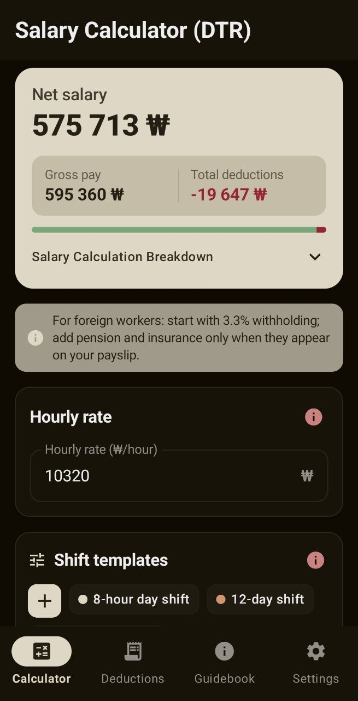
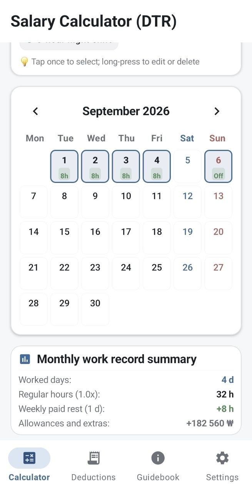
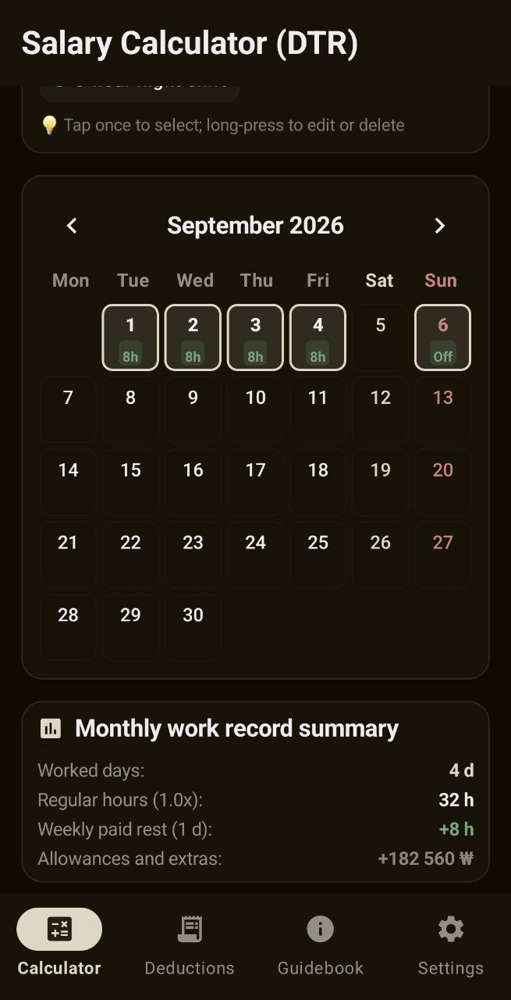
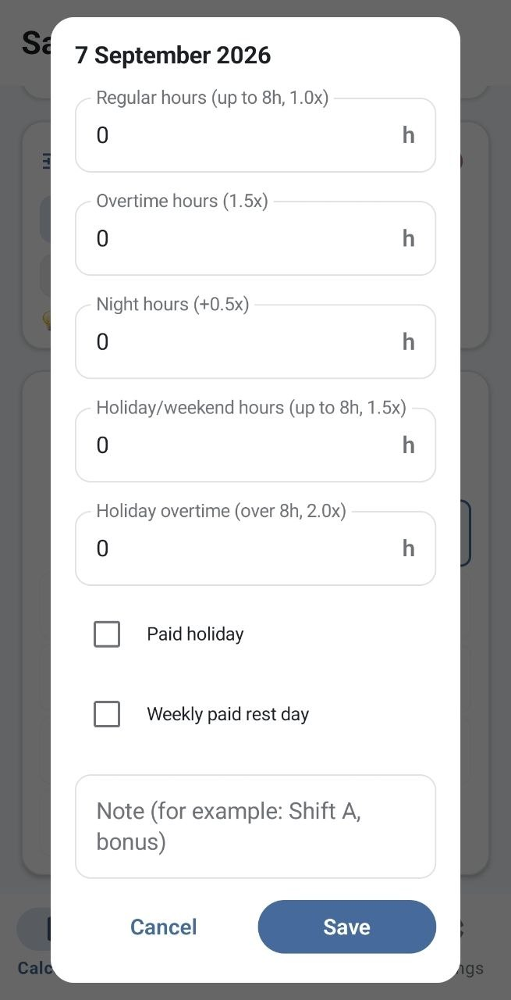
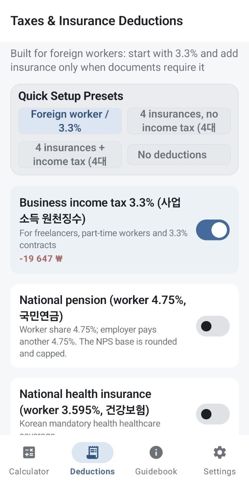
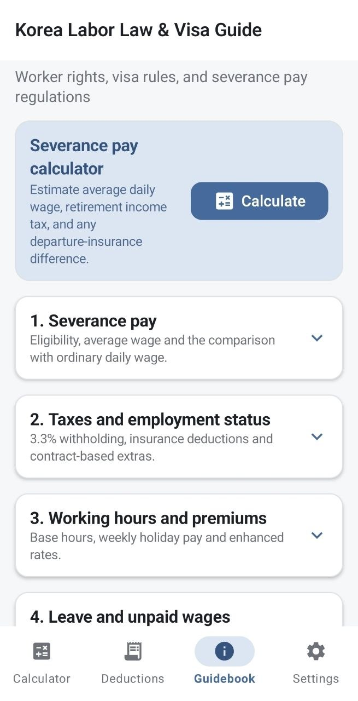
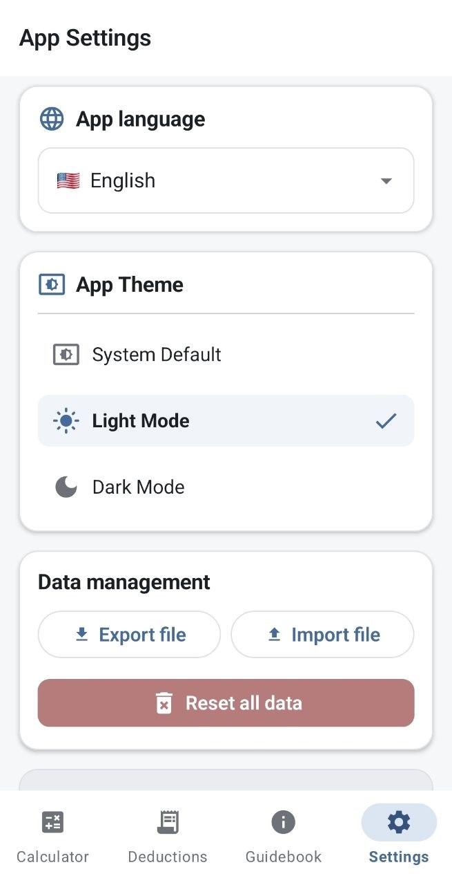

# K-Salary

**K-Salary** is an Android salary calculator designed for workers in South Korea.

It helps calculate estimated monthly earnings based on working hours, overtime, night shifts, holiday work, allowances and deductions. The app also includes a severance pay calculator and multilingual information about salary-related rules in Korea.

## Features

- Regular working hours and base salary
- Weekly paid holiday allowance (주휴수당)
- Overtime pay (연장근로)
- Night work allowance (야간근로)
- Holiday and holiday overtime pay
- Custom bonuses and allowances
- 3.3% withholding mode
- National Pension
- Health Insurance
- Long-Term Care Insurance
- Employment Insurance
- Estimated income tax
- Custom deductions
- Severance pay calculator (퇴직금)
- Shift templates and local data storage
- Light and dark themes

## Languages

K-Salary currently supports 12 languages:

- Russian
- Korean
- English
- Kyrgyz
- Uzbek
- Kazakh
- Vietnamese
- Thai
- Filipino
- Indonesian
- Malay
- Burmese

## Screenshots

### Calculator

  
  

### Shift Calendar

  
  

### Features

  
  
  

  

## Technology

- Kotlin
- Jetpack Compose
- Material 3
- Room Database
- Android Architecture Components
- KSP
- Gson
- Gradle Kotlin DSL

## Requirements

- Android 8.0 (API 26) or newer
- Target SDK: Android API 35
- Java 17

## Privacy

K-Salary performs calculations locally on the device. Salary information and user settings are stored locally by the application.

## Disclaimer

K-Salary provides estimated calculations for informational purposes.

Actual salary, taxes, insurance contributions and severance payments may vary depending on employment status, contract terms, company policies and applicable Korean regulations.

The application does not replace professional legal, tax or accounting advice.

## Status

K-Salary is currently under active development.

Version: **1.0.0**

## License

Copyright © 2026 AlvexFlow.

All rights reserved. See [LICENSE](LICENSE) for details.

## Privacy

See the [Privacy Policy](PRIVACY_POLICY.md).

---

Developed by **AlvexFlow**
